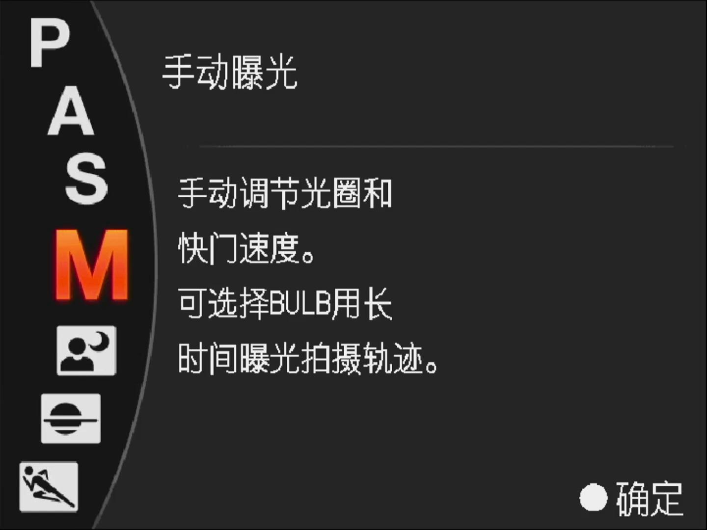

# 项目概述

这个项目最开始的定位是一个读书笔记而已。

原来是五年前对[Langford 's Basic Photography](https://www.sciencedirect.com/science/book/9780240521688)的读书笔记。
后来发现教科书内容总是不那么灵活，因此也就不局限于教材本身，准备从更多方面来收集资料。比如 https://swestern.weebly.com/35-mm-photography.html 等网站的很多内容。

现在就尝试着将其改成一个类似简单指南的探索项目吧。

# 1. 拍照之前

在开始拍照之前，让我们先探讨一些背景话题。

关于这些话题以及与本项目相关的所有内容，每个人都可以有自己的观点和看法。

君子和而不同，这是非常正常的。

## 1.1 基础背景

### 1.1.1 认清时代的趋势

视觉是人类获取信息的主要途径，而出于社会生活习性，人又有分享的冲动。

将所见的场景固定下来并分享给更多人看曾经是一项艰巨的任务。

古代乃至近代，需要专门培训过的技术人员进行绘制。

然而，摄影术的诞生使人类终于能够将一段时间内的景象固定下来，供更多人观看。

随后人们发现，摄影不仅能记录场景，还能冻结或延长时间。

通过高速快门，我们可以看到奔跑中的马蹄是什么样子。

通过长时间曝光，我们可以看到天空中肉眼难以发现的星体。

在上世纪末，摄影在本土仍然是相对稀罕的事物，与大众的日常生活有一定距离。

然而，上世纪七十年代以后，本土出现了“四月影会”和“西北风摄影”。

这些摄影团体中的许多作品将普通人作为拍摄对象，因此有人称之为“平民视角的摄影”。

但事实真的如此吗？

恐怕未必。

无论是“四月影会”中的文艺青年，还是“西北风摄影”中的先驱人物，更多的是将镜头对准平民。

此时，平民作为“客体”被人“欣赏”，被人从自己的生活中捕捉到一闪而过的闪光瞬间，然后将其串联成符合“文化人”口味的精美饰品。

幸运的是，随着时代的发展和技术的进步，数字时代的到来大大降低了摄影的门槛。

在1930年代，曹元宇老先生的《摄影术》一书中，大量涉及了化学知识作为背景知识；

到了1970年代，Don Sheff买下了纽约摄影学院，并创作了一系列教材，其中化学知识已经大大减少；

而在2010年代，市面上绝大多数摄影教材都以数码摄影为主要内容。

胶片摄影不仅涉及到胶片本身的物料成本，还有复杂的技术层面带来的学习成本，以及拍摄成功率不确定性所带来的机会成本，还有拍摄后冲洗和放大等额外流程成本。

而数码摄影则通过廉价的存储卡取代了昂贵的胶片，数字图像处理技术也提供了更多的容错空间，而借助互联网尤其是移动互联网实现的图片分享更降低了传播成本。

属于大众的摄影至少要从数码时代开始。

真正的平民视角是广大民众作为主体，从自己的视角出发，去审视和欣赏整个世界。

然而，大众更倾向于选择短视频。

这也是正常的，毕竟声音和画面的结合能够带来更丰富的感官体验，再加上一些荒诞的故事或耸人听闻的剧情，更能成为传播的利器。

而静态图片的摄影，现在看来，有点淡出流行的感觉了。

精心拍摄的照片，经过前期准备和后期处理后上传到社交网络，未必能够获得太多的关注和点赞。

相比之下，如果在同样的时间内拍摄一个极低成本的对口型音乐视频，可能会获得几倍甚至更多的流量。

一方面，大众传播平台往往流行短平快的浅层次阅读体验，另一方面，这些平台也有相应的推荐机制和用户偏好。

人倾向于选择满足需求的廉价品，这种廉价不仅是成本意义上的，也是行为意义上的。

阅读图片所需要投入的精力往往过高，还是视频更容易给人带来直观的刺激。

因此，我们要做好心理准备，不要对作品的传播抱有太高的期望。

### 1.1.2 常见相机分类

一般来说，常见相机可以根据镜头是否可更换、取景方式等因素进行分类。

需要注意的是，便携相机未必就不够专业，单反相机也未必就能满足所有专业需求。具体情况还要根据具体产品的功能参数和适应场景来判断。

对于新手来说，可能会觉得拿着单反相机挂着长焦镜头看起来很帅气，但实际上这只是在特定场景下才会用到的设备组合。而且，设备本身并不值得过多的精力投入，拍摄的内容才是最重要的。

仪式感和高画质所带来的加成往往是初级和廉价的。任何人都可以随便弄一套相机镜头，再加上一些灯具和支架等等，就像是在角色扮演一样，看上去很厉害。再穿上导演马甲，带上各种摄影组织或器材厂商的标牌，挂个图库认证之类的，看上去就更像那么回事了。但实际上，拍摄的效果往往是另外一回事。

就像高明的厨师未必总是用最昂贵的刀具一样，摄影师也不必追求最昂贵的设备。但是，摄影师应该根据自己常用的场景和个人习惯选择适合自己的工具组合。

因此，作为拍摄者，我们不应该过分沉迷于设备参数，但也需要有一定的基础认知，以便构建适合自己的工具组合。

比较常见的相机分类如下：

| 相机类型         | 镜头是否可更换           | 优势                                                                                                                                            | 劣势                                                                       |
| ---------------- | ------------------------ | ----------------------------------------------------------------------------------------------------------------------------------------------- | -------------------------------------------------------------------------- |
| 手机             | 不可更换，可附加外置     | 1. 尺寸极小，方便携带，随时随地拍摄；` `2. 有多摄机型，适合日常拍摄，且具有大量后期应用；` `3. 能通过外接少数滤镜提升效果。           | 1. 画质相对差，小传感器；` `2. 缺乏充足的专业摄影功能和手动控制选项。 |
| 便携相机         | 不可更换，部分机型可附加 | 1. 尺寸小巧，方便携带；` `2. 不可更换镜头，但多自带变焦镜头；` `3. 画质一般比手机强。                                                 | 1. 镜头焦段范围有限；` `2. 操作界面相对简单，功能不如单反相机全面。   |
| 旁轴相机         | 部分机型可更换           | 1. 尺寸稍小；` `2. 部分机型可更换镜头，适应不同拍摄需求；3. 具备较高的画质和拍摄性能。                                                     | 1. 取景与拍摄有差异；` `2. 部分机型对焦系统相对不如单反相机。         |
| 单反相机         | 可更换                   | 1. 丰富镜头群；` `2. 较高画质和拍摄性能；` `3.高速对焦和连拍，适合复杂场景；` `4. 提供全手动控制选项，满足专业摄影需求。         | 1. 体积较大，不便携带；` `2. 操作相对复杂，需要一定的学习成本。       |
| 无反（微单）相机 | 可更换                   | 1. 尺寸稍小，方便携带；` `2. 较高画质和拍摄性能；` `3.高速对焦和连拍，适合复杂场景；` `4. 提供全手动控制选项，满足专业摄影需求。 | 1. 镜头群相对有限；` `2. 同规格镜头往往比单反要贵。                   |

### 1.1.3 传感器尺寸

在民用市场上，数码相机的传感器尺寸通常被称为“画幅”。
画幅首先对画质产生影响。一般来说，相同生产工艺下，画幅越大的传感器能够提供更好的成像质量。然而，在充足的光线条件下，较小画幅的传感器也能够获得不错的成像效果。

画幅还会影响视野。假设使用相同焦距的镜头，在相同距离的物体上进行对焦和拍摄，画幅越大则视野越广。一般来说，我们以全画幅机身上对应镜头的视野作为参照标准。在比全画幅更小画幅的机身上，可以通过“转换系数”来计算按全画幅等视野的焦距。例如，M43系统的转换系数是2，意味着24mm焦距的镜头在M43机身上所得到的视野相当于48mm焦距镜头在全画幅机身上的视野。同样地，通用的APS-C画幅的转换系数是1.5，意味着16mm焦距的镜头在APS-C机身上所得到的视野相当于24mm焦距镜头在全画幅机身上的视野。

画幅还会影响景深，这个概念现在引入过早了，后面讲到景深的地方再详细说。

比较常见的画幅尺寸如下：

| 设备                                          | 画幅                         | 对角线 Diagonal (mm) | 宽度 Width (mm) | 高度 Height (mm) | 宽高比 Aspect Ratio | 面积 Area (mm2) | 按全画幅等视野的焦距转换系数 Crop factor |
| --------------------------------------------- | ---------------------------- | -------------------- | --------------- | ---------------- | ------------------- | --------------- | ---------------------------------------- |
| iPhone5                                       | 1/3.2  英寸                  | 5.68                 | 4.54            | 3.42             | 4/3                 | 15.5            | 7.61                                     |
| iPhone 6                                      | 1/3  英寸                    | 6                    | 4.8             | 3.6              | 4/3                 | 17.3            | 7.21                                     |
| iPhone XS                                     | 1/2.5  英寸                  | 7.18                 | 5.76            | 4.29             | 4/3                 | 24.7            | 6.02                                     |
| GoPro HERO3                                   | 1/2.3  英寸                  | 7.66                 | 6.17            | 4.55             | 4/3                 | 28.1            | 5.64                                     |
| 小米 Mi 9                                     | 1/2  英寸                    | 8                    | 6.4             | 4.8              | 4/3                 | 30.7            | 5.41                                     |
| 华为 P30 Pro                                  | 1/1.7  英寸                  | 9.5                  | 7.6             | 5.7              | 4/3                 | 43.3            | 4.55                                     |
| 三星 Galaxy S20 Ultra                         | 1/1.33  英寸                 | 12                   | 9.6             | 7.2              | 4/3                 | 69.1            | 3.58                                     |
| Nokia 808 PureView                            | 1/1.2  英寸                  | 13.33                | 10.67           | 8                | 4/3                 | 85.4            | 3.24                                     |
| 小米 Mi 11 Ultra                              | 1/1.12  英寸                 | 14.29                | 11.43           | 8.57             | 4/3                 | 98.0            | 3.03                                     |
| Sony RX100                                    | 1  英寸                      | 15.86                | 13.2            | 8.8              | 3/2                 | 116.2           | 2.72                                     |
| M43, Olympus EPL1                             | 4/3  英寸                    | 21.6                 | 17.3            | 13               | 4/3                 | 224.9           | 2                                        |
| Canon EF-S                                    | APS-C(Canon)                 | 26.82                | 22.3            | 14.9             | 3/2                 | 332.3           | 1.61                                     |
| Sony α, Sony E, Nikon DX, Pentax K, Fuji X   | APS-C                        | 28.2                 | 23.6            | 15.6             | 3/2                 | 368.2           | 1.5                                      |
| Canon APS-H                                   | APS-H(Canon)                 | 33.5                 | 27.9            | 18.6             | 3/2                 | 518.9           | 1.29                                     |
| Canon EF, Nikon FX, Sony α, Sony FE, Leica M | 35 mm 全画幅                | 43.3                 | 36              | 24               | 3/2                 | 864             | 1                                        |
| Pentax 645D, Fuji GFX 50S                     | 44 × 33 mm                  | 55                   | 44              | 33               | 4/3                 | 1441            | 0.78                                     |
| Kodak KAF 39000 CCD                           | Kodak KAF 39000 CCD          | 61.3                 | 49              | 36.8             | 4/3                 | 1803            | 0.71                                     |
| 中画幅 6×4.5 cm                              | 6×4.5 cm (645 format)       | 70                   | 42              | 56               | 3/4                 | 2352            | 0.61                                     |
| 中画幅 6×6 cm                                | Medium-format 6×6 cm        | 79                   | 56              | 56               | 1/1                 | 3136            | 0.54                                     |
| 中画幅 6×7 cm                                | Medium-format 6×7 cm        | 89.6                 | 70              | 56               | 5/4                 | 3920            | 0.47                                     |
| 中画幅 6×8 cm                                | Medium-format 6×8 cm        | 94.4                 | 76              | 56               | 4/3                 | 4256            | 0.46                                     |
| 中画幅 6×9 cm                                | Medium-format 6×9 cm        | 101                  | 84              | 56               | 3/2                 | 4704            | 0.43                                     |
| 大画幅 4×5 英尺                              | Large-format film 4×5 inch  | 150                  | 121             | 97               | 5/4                 | 11737           | 0.29                                     |
| 大画幅 5×7 英尺                              | Large-format film 5×7 inch  | 210                  | 178             | 127              | 7/5                 | 22606           | 0.24                                     |
| 大画幅 8×10 英尺                             | Large-format film 8×10 inch | 300                  | 254             | 203              | 5/4                 | 51562           | 0.14                                     |

### 1.1.4 镜头焦段用途

一般来说，镜头的标准焦距接近传感器对角线的长度。以全画幅相机为例，传感器对角线长度约为43mm，因此40-50mm的焦距被称为标准镜头。由于历史原因，全画幅相机通常以50mm作为标准镜头的焦距。焦距比标准镜头短的被称为短焦镜头，也被称为广角镜头，因为它们具有广阔的视野；焦距比标准镜头长的被称为长焦镜头，也被称为远摄镜头，因为它们可以放大远处的景物。实际上，广角镜头也可以用于近距离的微距拍摄，而长焦镜头也有一些可以进行近距离的微距拍摄。

有人说全画幅相机上35mm镜头的视野与人类双眼的自然视野相似，50mm镜头的视野与人类单眼的自然视野相似，但这种说法并不准确。严格来说，人眼的自然视野要比全画幅下35mm镜头的视野宽得多，并且还受到聚焦对象与人眼距离的影响。人眼观察事物的过程不仅涉及光学因素，还包括信息处理环节，因此不能简单地将相机镜头的视野与人眼的视野进行直接比较。关于标准镜头焦距的判定，我们以传感器对角线长度和历史沿革作为参考。这就像胶片规格（如135、120等）最初并没有严格的数值标准化命名，而更多是特定产品系列广泛应用后的一种传承。

焦距固定的镜头被称为定焦镜头，而焦距可调的镜头被称为变焦镜头。

镜头除了焦距之外，另一个重要参数是光圈，也就是镜头段通光孔径。

有的变焦镜头随着焦距变化最大光圈也会有变化，这种比较便宜；还有的变焦镜头在各个焦距上最大光圈都是一致的，这叫“恒定光圈”，就一般会更贵一些。实际使用中，恒定光圈的变焦镜头成像质量往往更好，对焦速度也更快。

关于镜头使用的更多详细内容，我们将在后面的章节中进行介绍。

下表是常见变焦镜头的一些常规应用场景：

| 焦段                | 星轨星空 | 银河流星 | 完整天空 | 夸张建筑 | 日常旅游 | 室内人像 | 特写人像 | 望远景物 | 野生动物 |
| ------------------- | -------- | -------- | -------- | -------- | -------- | -------- | -------- | -------- | -------- |
| 10-18mm             | ⭐⭐⭐   | ⭐⭐⭐   | ⭐⭐⭐   | ⭐⭐⭐   | ❌       | ❌       | ❌❌     | ❌❌❌   | ❌❌❌   |
| 16-35mm F/2.8       | ⭐⭐     | ⭐⭐⭐   | ⭐⭐⭐   | ⭐⭐⭐   | ⭐       | ⭐⭐     | ❌❌     | ❌❌     | ❌❌     |
| 16-35mm F/4         | ⭐       | ⭐⭐     | ⭐⭐⭐   | ⭐⭐⭐   | ⭐       | ⭐⭐     | ❌❌     | ❌❌     | ❌❌     |
| 28-70mm F/3.5-5.6   | ⭐       | ⭐       | ⭐       | ⭐       | ⭐⭐     | ⭐⭐     | ⭐       | ❌       | ❌       |
| 24-70mm F/2.8       | ⭐⭐     | ⭐⭐     | ⭐⭐     | ⭐⭐     | ⭐⭐     | ⭐⭐⭐   | ⭐⭐     | ❌       | ❌       |
| 24-105mm F/3.5-4.5  | ⭐       | ⭐       | ⭐⭐     | ⭐⭐     | ⭐⭐     | ⭐⭐⭐   | ⭐⭐     | ⭐       | ❌       |
| 28-200mm F/2.8-5.6  | ⭐       | ⭐       | ⭐       | ⭐       | ⭐⭐⭐   | ⭐⭐⭐   | ⭐⭐     | ⭐⭐     | ⭐⭐     |
| 35-150mm F/2-2.8    | ⭐       | ❌       | ❌       | ❌       | ⭐⭐⭐   | ⭐⭐⭐   | ⭐⭐     | ⭐⭐     | ⭐       |
| 50-400mm F/4.5-6.3  | ❌       | ❌❌     | ❌       | ❌❌     | ⭐⭐⭐   | ⭐⭐     | ⭐⭐⭐   | ⭐⭐⭐   | ⭐⭐⭐   |
| 70-200mm F/2.8      | ❌❌     | ❌❌     | ❌❌     | ❌❌     | ⭐⭐     | ⭐       | ⭐⭐⭐   | ⭐⭐     | ⭐       |
| 70-200mm F/4        | ❌❌     | ❌❌     | ❌❌     | ❌❌     | ⭐⭐     | ⭐       | ⭐⭐⭐   | ⭐⭐     | ⭐       |
| 100-300mm F/4.5-5.6 | ❌❌     | ❌❌❌   | ❌❌❌   | ❌❌❌   | ⭐       | ❌❌     | ❌❌     | ⭐⭐     | ⭐⭐     |
| 150-600mm F/5-6.3   | ❌❌❌   | ❌❌❌   | ❌❌❌   | ❌❌❌   | ❌       | ❌❌❌   | ❌       | ⭐⭐⭐   | ⭐⭐⭐   |

## 1.2 场景和设备

好吧，无论如何，既然我们已经决定要拍照了。

在开始拍照之前，让我们先问问自己，为什么要拍照？我们想要为哪些对象或场景留下影像？我们希望拍摄出怎样的照片呢？

当然，并不需要立即给出明确的答案。

有时候，我们做事情并不总是有着明确的目的，有时候是随心所欲，有时候是随遇而安，有时候是随波逐流。

此外，人的想法也会随着时间的推移而改变，最初的梦想可能会被放下或修改，最初的立场也可能会发生变化等等。

但是，我们仍然需要有一个大致的初步认知。

因为这些答案将决定我们在当前阶段应该如何选择设备。

每个人都有自己的志向，对于同样的事物，不同的人可能有截然不同的动机。

虽然动机可能不容易明确，但将其归类到不同的场景中会更加方便。

不同的场景需要不同的器材组合。

下面的内容只是一个大致的概述，如果有些术语内容读者暂时不太明白也没关系，以后会逐渐了解的。

### 1.2.1 拍家人朋友

在上世纪末或者本世纪初期，民众购买相机的最常见动机是为了给家人拍照留念。

当时去照相馆拍照的价格很昂贵，甚至在旅游景区拍照也可能需要支付十块二十块的费用。

拍照留念的需求往往追求性价比，而并非对摄影本身有着深厚的热爱。

二十多年前，我父亲花了180块钱购买了一台腾马便携相机，用来给家人拍照。

那台相机的型号好像是M800，使用135胶卷，自带了35mm镜头，固定光圈为F/3.5。

除了相机本身，胶卷和冲洗费用也是持续不断的成本。

后来我父亲觉得一卷40块钱的富士胶卷实在太贵，于是放弃了继续使用。

当时的单反相机可能价格更高，节俭的年代很难舍得花那么多钱给家人拍照。

然而实际上，使用单反相机可以获得更好的拍摄体验，即使是真正自动对焦的便携相机也比泛焦镜头更好。

家庭环境通常是室内，照明条件并不理想，固定光圈的泛焦镜头画质总是不太理想。

如果我能回到过去，我一定会建议他购买二手的美能达或宾得自动单反套机。

那时候的价格大约相当于现在的1800块钱。以我当时喜欢吃的土豆丝卷饼为例来粗略类比。

二十多年前，我在读高中时，一份不加鸡蛋的土豆丝卷饼价格是五毛钱，加一个鸡蛋则是一块钱。

今天下午（2023年12月11日），我碰巧又买了一个差不多规格的土豆丝卷饼，也加了一个鸡蛋，花了十块钱。

那么从土豆丝卷饼加鸡蛋的价格来粗略类比，当时的180块钱大约相当于现在的1800块钱。

现在用1800块钱，大概只能买一些拍立得相机或超小画幅的便携相机，前者后续成本高，后者画质极差，都不太划算。

当然也可以购买二手的索尼NEX微单相机，或其他品牌的二手入门级单反相机。

在室内拍摄人像时，需要考虑镜头焦距和光圈，前者限制视野和拍摄距离，后者影响可用快门速度。

特别是在给小朋友拍照时，闪光灯可能会晃到孩子，因此需要尽量使用高感光度和高速快门。

对于其他人物在一般室内场景的拍摄，考虑到手持稳定性和画面范围，也不适合使用太长焦距的镜头。

综合考虑，使用24-105mm F/4或24-70mm F/2.8等类似参数的变焦镜头会更加方便。

### 1.2.2 拍学校生活

在本世纪初期，我这一代人开始上大学，发现有些专业需要使用相机。

例如，许多大学生参加实习或调查研究时需要拍照。

在这种情况下，通常是小组从学校或系部借来各种相机，然后勉强应付使用。

借来的相机始终不如自己购买的使用舒适，一些同学在勤工俭学或获得奖学金后会选择购买自己的相机。

当然，那个时期数码单反相机价格昂贵，胶片相机门槛也很高，所以很多人选择了小型卡片相机。

十多年前，当我上大学时，我去中关村给人装电脑，一台机器能赚五十块，就这样慢慢熬。

攒了一段时间，我用500块钱买了一台爱国者的V1000卡片相机，1/1.8英寸1037万像素CCD，三倍光学变焦。

我用这台相机拍摄了一段时间的野外地质现象，还尝试拍摄矿物样本和显微镜下的矿物薄片等。

正是这段时间的拍摄经历，让我体验了卤钨灯、LED灯等不同光源的光谱连续性差异。

后来在拍摄金属硫化物时，我还探索了红外摄影，并尝试了外置偏光拍摄方案。

当然，有了第一台数码相机后，我自然也会用它来拍摄身边的同学。

当时，同学们对我拍摄他们有些抵触，一方面是因为有点害羞，另一方面是觉得我拍摄的生活场景不够好看。

然而，十多年后，他们再次看到这些照片时，往往会感慨时光易逝，遗憾当年没有拍更多的照片。

学校里通常比较明亮，宿舍、教室、图书馆等都有严格的照明标准，因此通常不需要太高的感光度和大光圈。

一般情况下，各种相机的套头（如APS-C画幅的18-55、135画幅的28-70等）基本足够使用。

如果希望消除复杂背景带来的干扰，还可以额外添加一些能够突出主体并缩小背景视角的长焦镜头。

### 1.2.3 拍风光景物

人怕入错行，之前的行当需要四海为家，四处漂泊。

也许是由于所学内容关注的都是几个百万年以上的时间尺度，当时对眼前的山川风光没有太多吸引力。

然而，一些同行的老师和同学却对拍摄这些景物非常喜爱，无论是天山长河、大漠瀚海、乡村田亩还是都市街头。

当时，许多景物在直观上看起来很震撼，但拍摄出来的照片总觉得缺乏意义。回想起来，可能是当时的设备容忍度较低。

然而，也有一些老师和同学能够拍摄出精致的画面，他们常常需要在日出和日落之前早早出发，抓住短暂的拍摄窗口。

有些地方的山水风光清秀出众，有些地方的民居建筑历史悠久，还有些地方的钢铁森林壮观震撼。

对于某些学科来说，摄影是一种重要的工具，风光和景物本身可能只是信息的载体。

例如，杜塞尔多夫艺术学院的贝歇夫妇（Bed & Hilla Becher）专门拍摄人类的工业建筑，北京工业大学的杨晓利老师四处拍摄古塔。

拍摄风光景物可能需要广角镜头，也可能需要长焦镜头。

广角镜头用于近距离拍摄广阔的范围，尽量包含更多的背景信息；长焦镜头则用于突出主体，减少背景信息。

这两种情况都可能发生，因此使用28-200、28-300、24-240等大变焦镜头是一个不错的选择。

这类镜头被称为“一镜走天下”的“天涯镜”，虽然画质通常不是特别出色。

然而，摄影最重要的是捕捉内容，画质实际上是次要的。

许多拥有高画质设备的器材爱好者并不一定能拍摄出有趣的内容。

相反，如果你拍摄的内容足够有趣，画质稍差也是可以忍受的。

内容层面上的存在与否是关键，而画质层面上只是精细程度的问题。

当然，如果你想拍摄一些特殊场景，就需要相应的特殊设备：

- 拍摄星野（天空和地面景观），可能需要大光圈超广角镜头和稳定的三脚架；
- 拍摄深空（星系、星云等），可能需要大口径长焦镜头，并配备赤道仪等设备；
- 拍摄星轨（地面景观加上天空中星星的轨迹），可能需要支持长曝光的快门遥控器。

### 1.2.4 拍体育动物

从拍摄过程来看，拍摄运动员和拍摄动物的难度相似。

首先，你必须对拍摄对象有足够的了解：

- 了解场上运动员的角色分工；
- 了解所拍摄动物的生活习性。

其次，在拍摄时要多使用高速连拍：

- 运动场景瞬息万变，一旦错过就无法补拍；
- 动物不会配合拍摄，因此要尽量捕捉画面。

此外，拍摄时通常需要保持一定的物理距离：

- 运动员在体育赛事中不希望被干扰，所以不能离得太近；
- 动物可能会感到害怕或产生敌意，因此也不能离得太近。

因此，拍摄体育赛事和野生动物通常需要使用长焦镜头，具备快速对焦和连拍功能。

早些年的各种所谓“新闻机”专门为新闻记者设计，具备出色的对焦和连拍速度。

在镜头选择方面，你可能需要考虑使用70-200mm F/2.8这种中长焦大光圈镜头，或者是150-600mm F/5-6.3等大长焦镜头。然而，这些镜头通常较重。

某些镜头可能具备更长的焦段和更好的画质，例如300mm F2.8、600mm F/4等长焦定焦镜头，但它们也特别沉重。实际使用起来不太方便，通常需要在场地上使用三脚架，至少也需要单脚架以便移动。

为了兼顾轻便性和长焦距，你可能需要考虑使用100-300mm F/4.5-5.6 APO这种镜头。然而，画质和对焦速度可能稍逊一些。

### 1.2.5 拍商品静物

以前在四川出差的时候，我看到当地人经常吃炒饭。当地的烹饪师傅告诉我，最难做的炒饭其实是家常炒饭。

虽然看起来大家都会做，但要做得好吃却需要花费很多功夫。

静物摄影看起来似乎很简单，毕竟物体不会动。但实际上，这可能是最困难的摄影领域之一。

在这种场景下，最困难的部分是灯光的布置，特别是针对不同材质和反光率的物体。

虽然在网上买一个带灯的静物摄影箱，或者自己用几个台灯和硫酸纸来应付似乎可以拍摄静物照片。

但是，这与真正商业化的静物摄影相差甚远。

此外，灯具也有寿命，随着使用时间的增长，亮度和色彩还会发生变化，这些都需要考虑到。

因此，虽然这类场景一开始看起来最简单，但在后期发展中需要投入更多的时间和成本。

在静物摄影中，需要考虑的灯光不仅包括闪光灯，还包括常亮灯，而且通常不只是一盏灯。

当然，好处也是有的，就是通常不需要使用太昂贵的镜头。

著名广告摄影师熊谷晃经常使用的尼康 24-85mm F/2.8-4 D 只是一枚二手廉价镜头，他甚至偶尔将其用作微距镜头，就能应付许多商业拍摄场景的印刷需求。

电商摄影有时已经成为一项需要大量体力的工作。对于特定主题，可能需要进行足够的专业定制，以形成差异化，使竞争对手难以追赶，从而形成竞争壁垒。

### 1.2.6 拍时尚人像

作为一个浅陋的人，我认为时尚这个词有些贬义。

时尚摄影似乎更多地延续了贵族画像和沙龙摄影的风格。

通常是将人物精心打扮后，拍摄出各种妖娆婀娜的形象。

在这类摄影过程中，服装、化妆和道具都起着重要的作用，拍摄工作需要依赖这些步骤。

当然，有些人喜欢拍摄看起来并不像真实自己的照片。

否定自己，将自己想象成另一个形象，这是人类常有的行为。

特别是在婚礼和庆典等场合，总有人希望这一天成为特殊的日子，愿意接受拍摄特定风格的假象影像。

与一些摄影爱好者幻想的使用85mm F/1.4或者135mm STF等镜头不同，婚庆场景更多地使用24-70mm F/2.8和70-200mm F/2.8这类方便快捷的变焦镜头，通常还会使用多个机位，提前规划灯光和节奏。这些活动更多地是团队配合的流水线作业，是技术完善的现成工序组合。

至于商业棚拍，如明星宣传照或杂志封面等，形式各异。对于他们来说，找明星拍摄本身就具有吸引力和流量，拍摄出来的东西可以更加奇特，使用什么设备来实现并不重要。通常是助理去探索拍摄，领头人只是挂名而已。

还有一些与游戏、动漫相关的展览，或者车展、乐器展等，也有人喜欢扮演角色，也有人乐于拍摄。这些场景通常光线复杂，有些甚至不允许使用闪光灯，因此光线的使用更需要留心。至于相机和镜头，看起来符合要求就基本能达到拍摄者的目的。照片本身未必有太大区别，因为在现场看不到成片之前，被拍摄的人只能根据设备的“专业程度”来评判。

毕业纪念和合影留念等场景可能与婚庆类似，但通常更加简单。许多学校喜欢在正午的大太阳下拍摄合照，好处是曝光时间短，能够快速完成；坏处是阳光刺眼，大家都眯着眼睛，拍出来的照片往往阴阳脸。当然，参与者们未必在乎照片最终是否好看，这个过程似乎更有意义。

需要注意的是，如果合照中的被拍摄对象很多，需要考虑使用合适的广角镜头。如果拍摄距离不允许一次性覆盖所有人，可以多角度拍摄，然后后期合成。

如果只是对这类照片有兴趣，那并不太麻烦，只需要在前后期各自留意。

如果要从事相关的专业拍摄工作，需要做好吃苦和劳累的心理准备，提前考虑行业现状，人力成本低廉，出头机会少。

## 1.3 初学该用啥

这个问题可能是许多初学者最关心的，但实际上它并不是最重要的。

因为大多数人现在都有手机，最初的学习阶段使用手机就可以满足大多数拍摄需求。

随着学习的深入和个人偏好的明确，选择相机设备会变得自然而然。

根据领域内的行业标准来选择设备组合，预算充足的话可以选择高配，预算有限的话可以选择平替，就这么简单。

当然，拥有一台相机会给拍摄带来不同的感觉，仪式感也是很重要的。

考虑到初学者的入门体验，我们只讨论数码相机，暂时不考虑胶片相机。

此外，我们主要关注拍照而不是视频性能。

因此，让我们粗略地按照当前（2023年12月12日）的预算从低到高来看一下。

请注意，下面的预算是指总预算，包括相机机身和镜头的全部成本，而不是仅指机身，而且默认配备都是各家原厂套头。

### 1.3.1 三位数预算

#### 1.3.1.1 要避免的坑

如果只有三位数的预算，可选的机型不多，而且还要排除掉很多坑。

这些坑货基本都是年代久远，画质低劣，不如当前同价位的某些手机。

首先要排除的是二手市场上被炒作到几百块的所谓“CCD卡片机”。

这些古董卡片机当年只值几百块，前些年甚至只值几十块钱，但近年来被奸商炒作起来了价格。

其次要排除的是那些商贩卖的伪4K高清相机，它们根本无法报出具体型号。

这些假货的来源不明，有些可能只是用行车记录仪随便改装而成，完全是垃圾。

接下来要排除的是一些野生品牌在网上销售的卡片机，它们纯粹是骗人的。

这些山寨货根本不值得浪费时间和精力去尝试，而且也无法与同价位的手机相比。

虽然有很多坑，但只要大家不贪图便宜，基本上就不会上当。

#### 1.3.1.2 百元二手机

那能买的有哪些呢？在这个预算范围内，通常只能考虑购买二手设备。

我曾经使用过以下这些价格范围内的机身组合：

- 索尼RX100M1：相当怀旧，2012年发布，配备1英寸传感器，2020万像素，3.6倍光学变焦，实际焦距为10.4-37.1mm F/1.8-4.9，视野等效全画幅的28-100mm。对焦速度较慢，画质稍差，但相比一般手机，仍然有明显提升，而且非常轻巧。
- 奥林巴斯EPL1：堪称古典，2010年发布，采用M4/3传感器，1230万像素，配备14-42mm F/3.5-5.6套头，视野等效全画幅的24-84mm。对焦速度较慢，画质稍差，但便携性较好。
- 佳能450D：非常古典，2008年发布，采用APS-C规格传感器，1220万像素，配备18-55mm F/3.5-5.6套头。对焦速度尚可，画质还不错，但操作稍显笨拙。
- 尼康D80：更加古典，2006年发布，采用APS-C规格传感器，1020万像素，配备18-55mm F/3.5-5.6套头。对焦速度尚可，但画质有些欠缺，操作稍显笨拙。
- 宾得K30：相当怀旧，2012年发布，采用APS-C规格传感器，1628万像素，配备18-55mm F/3.5-5.6套头。对焦速度较慢，画质还不错，而且具备机身防抖功能，外观多彩。
- 索尼A450：堪称古典，2010年发布，采用APS-C规格传感器，1420万像素，配备18-55mm F/3.5-5.6或18-70mm F/3.5-5.6套头。对焦速度尚可，画质还不错，而且具备机身防抖功能，操作稍显笨拙。
- 索尼NEX-3N：稍微怀旧，2013年发布，采用APS-C规格传感器，1610万像素，配备16-50mm F3.5-5.6或18-55mm F/3.5-5.6套头。前者为电动变焦，后者为手动变焦。对焦速度较慢，画质还不错，而且轻巧便携。

以上这些机型基本都可以在三位数的预算范围内购买，整体上对焦速度都不太理想。

需要明确的是，没有完美的机型，我们需要根据自己的需求进行排序，并尽量选择最适合自己的解决方案。

#### 1.3.1.3 具体怎么选

根据个人使用体验，索尼RX100M1是最轻巧的相机，而索尼NEX-3N的画质最佳。

然而，RX100M1的传感器较小且镜头固定，在暗光条件下表现不佳。而NEX-3N的索尼E卡口原生镜头性价比不高，转接方案玩法不如同品牌的全幅机身丰富。

从便携性和可更换镜头的角度来看，奥林巴斯EPL1是一个很好的选择，但其对焦速度较慢，画质也有所欠缺。

从镜头卡口成本来看，索尼A450采用的索尼A卡口镜头价格非常低廉，例如24-105mm F3.5-4.5等镜头只需几百块。

从机身体验来看，尼康D80具有肩屏和丰富的镜头选择，整体体验非常不错，但画质稍逊。

从直出色彩来看，佳能450D表现出色，初期拍摄可以省去很多后期调色的步骤，对于新手来说是个福音。

从耐用性来看，宾得K30非常出色，具备机身防抖功能，但对焦速度稍慢，而且可能会遇到光圈失效的问题，需要在光圈齿轮部位喷上WD40。

总体来说，宾得K30可能是最有趣的选择，结合宾得O-GPS1可以尝试进行天体追踪拍摄。然而，宾得的镜头相对较古老，近年来没有太多更新，二手价格也往往比其他品牌贵一些。

如果你打算升级机身，可以考虑索尼A450等A卡口单反相机，或者索尼NEX-3N等E卡口微单相机。借助索尼官方的LA-EA4、LA-EA5等转接环，可以充分利用A卡口镜头。索尼A卡口镜头价格便宜且种类丰富，例如美能达50mm F/2.8微距镜头、腾龙28-300mm F/3.5-6.3大变焦镜头、美能达24-105mm F/3.5-4.5变焦镜头、美能达100-300mm F/4.5-5.6 APO变焦镜头、美能达500mm F/8折反自动镜头等，都是在同焦段中性价比较高、画质出色的选择。

以前有人会建议购买身边镜头存量最多的相机品牌，例如周围人都用尼康就买尼康，周围人都用佳能就买佳能等。当时这样做是为了方便从朋友那里借用不同规格的镜头。然而，现在我们可以选择租用镜头和机身，租用价格也不高，一天几十块钱而已。租用完毕后归还，省心又方便。相比之下，借用他人的东西会涉及人情，还可能出现损坏的情况，何必呢？

#### 1.3.1.4 关于手动镜头

我非常喜欢手动镜头，但对于初学者来说，我不建议使用它们。

经典的手动镜头通常有很长的历史，可能已经使用了十年甚至二三十年，存在各种潜在的问题。

有些可能会有灰尘、雾气、胶水老化或发霉的问题，光圈可能会迟滞、漏油或粘连，甚至镜片可能会错位或光轴不正。

即使是经验丰富的摄影师，也有可能遇到问题，更不用说初学者了。

现代生产的高质量手动镜头往往价格不菲，很难在三位数的预算范围内购买。

一些杂牌的监控镜头往往像场范围狭小，覆盖M43尚显不足。

至于那些号称拥有古老光学技术的厂牌，可能在某些方面表现不错，但在日常拍摄中可能会有问题。

当然，如果你计划将来升级到索尼E卡口的A7R2或更高级别的全画幅机身，你可以考虑使用天工LM-EA7和LM-EA9这两个转接环，将许多手动镜头转换为自动镜头。

LM-EA7和LM-EA9都内置了马达，可以驱动镜头进行自动对焦。

它们在索尼A7R2及后续机型上表现良好，优点是将手动镜头转换为自动，提供了更便利的拍摄体验。

然而，缺点是它们可能会增加电池消耗，光圈需要手动调节，记录镜头信息也稍微麻烦，而且在暗光条件下对焦可能会有困难。

对于其他相机系统，我仍然不建议初学者使用手动镜头。

#### 1.3.1.5 放大对焦、峰值对焦、陷阱对焦

如果强要用手动镜头，就得考虑有放大对焦+峰值对焦或者陷阱对焦的机身。

放大对焦好理解，就是字面意思，在屏幕或者取景器上放大画面，为手动调整对焦提供视觉辅助。

峰值对焦就是在屏幕或者取景器上对被摄对象的清晰轮廓进行增强，如果边缘清晰了就会呈现明显的峰值，峰值颜色可以设置成白色红色黄色等。

使用手动镜头时，放大对焦和峰值对焦结合起来用比较方便，能显著提升成功率。

索尼NEX-3N之前的一些NEX系列微单相机早期固件可能没有峰值对焦，需要更新到最新的固件。

奥林巴斯EPL1等古早M43机型没有峰值对焦，手动使用存在很大挑战。

陷阱对焦，也可以从字面来理解。

粗略来说，就是当打开这种模式滞后，你对着被摄物体拧镜头的对焦环，或者等待被摄物体运动进入焦点位置，相机会自动释放快门。

宾得K30等古早单反都有陷阱对焦，但陷阱对焦存在一定滞后性，有失败概率，难以弥补宾得家对焦弱势。

### 1.3.2 四位数预算

这个价位是市场上的主流价位，但我已经很久没有购买过新机器了。因此，我只会提及几款我自己或朋友长期使用过的主流品牌相机。

#### 1.3.2.1 佳能80D

佳能80D在二手市场上存量很大，目前（2023年12月13日）四千多块钱就能买到一套成色不错的。

在镜头方面，你可以选择原厂套头，也可以选择各种价格实惠的第三方厂商镜头，比如永诺的佳能EF口50mm F/1.8，二手价格只需二三百块，性价比很高。

如果你选择佳能单反相机，一定要注意镜头和机身的兼容性问题。

佳能的EF镜头和EF-S镜头都是EF卡口，它们在物理安装上是互相兼容的，但在使用上情况会稍微复杂一些。

EF镜头是为全画幅机身设计的，而EF-S镜头则是为佳能APS-C单反机身设计的。

佳能APS-C画幅的机身可以使用EF-S镜头，也可以使用EF镜头。

然而，EF-S镜头不能安装在佳能全画幅相机上，如果强行安装，相机反光板在升起时会碰到EF-S镜头的后端。

佳能的机型在同一代中一般分为三个大类：

- 一位数代表全画幅机身，例如5D2、5D4等；
- 两位数代表高阶APS-C画幅机身，例如70D、80D等；
- 三位数代表入门APS-C画幅机身，例如450D、200D2等。

很难仅凭数值型号来判断优劣，例如200D2和70D相比，快门速度稍差，像素稍高，视野率稍差，视频功能稍强，对焦方面稍差，但电池续航稍好。

然而，我不推荐这两款机型，更推荐的是比200D2更早的80D。

这主要考虑到后续可能需要使用闪光灯，而80D对闪光灯的兼容性应该更好一些。

此外，80D在参数调整上也更加方便。

当然，如果你喜欢更高像素并且预算充足，可以选择90D，它具有更好的追焦、连拍、4K视频和摇杆操作。

佳能还有两个微单相机系列：

- 一个是使用EF-M卡口的APS-C画幅无反相机，M50基本上和80D差不多，M60二代基本上和90D一样。
- 另一个是使用RF卡口的全画幅无反相机，例如RP、R、R6、R5等等，RP和R是入门级别，R6和R5是进阶机型。

我没有使用过EF-M和RF卡口的机器。对于EF-M卡口的相机，我没有直接输出肤色的需求。而对于RF卡口的相机，我不喜欢使用限制第三方厂商镜头的专利。因此，我更倾向于选择其他卡口的相机。

#### 1.3.2.2 尼康D810

在与佳能80D对应价位的相机中，尼康D750是一个更好的选择。当前（2023年12月13日）二手市场上，你可以以四千多的价格购买一套尼康D750。

然而，尼康D750曾经存在“掉渣门”问题，即在光圈小于F/16时，传感器上会出现很多脏点。

如果你想更高一点的定位，尼康D800可能会有光圈漏油的问题，清理油污或更换光圈可能会很麻烦。

因此，为了避免总预算超过四位数，建议直接选择尼康D810。据说尼康D810也可能出现“掉渣”问题，但我个人并未遇到过。

尼康D810的二手价格至少在五千左右。这款相机拥有3600万像素的全画幅机身，对焦速度也不错，操作体验也很好。唯一的缺点是视频性能较弱，但在我们的摄影教材中，我们只关注拍照，所以这并不是个问题。

在镜头方面，你可以选择熊谷晃喜欢的24-85mm F/2.8-4镜头。这款镜头光圈较大，还可以用作微距摄影，二手价格也在千元以内。

尼康的一些镜头没有内置马达，无法在没有马达的机身上实现自动对焦。幸运的是，尼康D810具备马达，可以自动对焦任何可安装的自动镜头。这使得组建常用镜头群变得非常方便和经济实惠。

#### 1.3.2.3 宾得K1

宾得K1在对焦方面表现不佳，第二代相比第一代的提升有限，但二手价格相差约两千左右。

当前（2023年12月13日）宾得K1第一代的二手价格约为六千多，而K1第二代的二手价格则要超过八千。

考虑到实际体验上两代之间的差别并不显著，以及需要留出预算购买镜头，建议选择第一代。

宾得K1具有出色的防抖和像素偏移功能，在拍摄静止对象时能提供很大的帮助。

然而，如果需要应对其他场景，可能会有些困难。

对焦速度勉强跟得上当时的主流水平，连拍速度可能只有每秒个位数。

宾得的全画幅镜头相对较贵，而且很多都是上世纪胶片机时代的产品。

当然，也有一些性价比很高的选择，比如宾得DA35mm F/2.4等APS-C画幅镜头，实际上也能覆盖全画幅画幅。

宾得K1还有一款内置GPS的版本，可能是海外版本流入本地市场，使用起来也很方便。

#### 1.3.2.4 索尼A99

索尼的AXXX三位数系列是单反相机，而AXX两位数系列是单电相机，即内置半透膜而非反光镜的机型。

其中，索尼A99M2是最顶级的机型，但我们在这里讨论的是初代的索尼A99。

考虑到镜头成本，四位数的预算只能选择初代A99。尽管二代在各个方面更好，但价格一直居高不下，即使是二手也要八千多，这会压缩镜头预算。

目前（2023年12月13日），初代索尼A99的二手价格大约在三四千左右。而A口的原厂镜头，如28-75mm F/2.8，二手价格也在千元左右，而副厂镜头则更加便宜。

需要注意的是半透膜，如果损坏可能会导致对焦问题，这是一个潜在的风险。

此外，A99还有带GPS的版本，一般会稍微贵几百块。

与A99初代二手价格相当的还有A77M2，它在连拍和对焦方面更出色一些，但这是一款APS-C画幅的机身。

索尼A900单反的价格可能也在两三千左右，但个人感觉不值得推荐。

A900与A99在画质上差不多，但在对焦方面有很大差距。

此外，A900使用的是CF卡和MS记忆棒，不如A99或A77M2所使用的SD卡方便。

另外，A99等单电机型使用的是电子取景器，习惯后会发现它非常好用。

想象一下，在比较暗光的环境下，通过光学取景器几乎看不到任何东西，而电子取景器可以实时显示所见即所得。

在镜头方面，索尼A口提供了超级廉价且丰富的选择，只需四五百元就能购买到画质可观的24-105mm F/3.5-4.5镜头。

如果预算有限，一百多元就能买到35-70mm F/4这样的恒定光圈变焦自动镜头，它轻巧且具备微距功能，非常实用。

#### 1.3.2.5 索尼A7R2

这台机身非常推荐，目前（2023年12月13日）的二手价格在四千多到五六千之间，具体取决于成色。

然而，价格过低的机器也可能有坑，同时还需要注意传感器是否有损坏的风险。

索尼A7R2和A7R3在静态画质方面几乎没有区别，都具备静音拍摄和连拍功能，但续航时间稍短。

A7R2拥有4240万像素、399个相位对焦点、5轴防抖、眼控对焦和4K视频功能，各项参数都足够满足需求。

此外，A7R2内置的系统似乎基于某个版本的Android，可以通过安装APK应用程序来突破录像时间限制和使用内置数字滤镜等有趣的功能。

然而，这个基于Android的系统响应速度有点慢，主要体现在开机和照片写入方面。

如果不关机待机，配备的FW50电池容量又太小。

在拍摄RAW文件时，连续拍摄一段时间后可能会卡住停止，需要等待图像写入存储卡。

A7R3解决了A7R2的这些问题，但A7R3的二手价格可以购买两台A7R2。

考虑到两者几乎相同的单张静态画质，选择A7R2更具性价比。

当然，A7R3还具备类似宾得相机的像素偏移技术，可以实现超高像素照片合成等高级功能，而A7R2则不具备这些功能。

在镜头方面，如果追求极致性价比，可以尝试使用天工环转接手动头，但对于新手来说不推荐这样做。

索尼原厂的转接环中，LA-EA5不支持A7R2，因此只能使用LA-EA4和LA-EA3。

LA-EA4具有半透膜，会有一点点进光量损失，但内置马达，支持几乎所有原厂和副厂的A卡口镜头转接到E卡口机身上使用。

LA-EA3没有半透膜，支持机身相位对焦，但只能转接索尼A卡口的SSM、SAM等镜头，不支持需要螺丝刀对焦的A卡口镜头。

由于A7R2的机身价格可能不到五千块，所以即使购买原生E卡口镜头也有足够的预算。

索尼E卡口的镜头群目前已经非常丰富，原生E卡口镜头的选择也非常多。

### 1.3.3 五位数预算

到了这个预算范围，我们可以考虑一些在售的新品。然而，在这里我还是先介绍一些二手的旧机型，因为我对于新机型的了解有限。本节主要涵盖了目前（2023年12月13日）二手市场上售价在万元左右或以上的机型。

在这个预算范围内，我们不必过于担心镜头预算对整体预算的影响，因此机身本身的价格往往在八九千乃至万元以上。

我之所以只提及尼康和索尼两家的产品，是因为我没有使用过其他品牌在这个价位区间的相机。

#### 1.3.3.1 尼康D850

如果你只关注摄影而不拍摄视频，尼康D850是尼康全幅单反相机中的终极选择。

与尼康自家的Z卡口微单相机相比，D850的主要缺点是视频对焦性能较差、机身没有防抖功能，并且使用的是F卡口。

那么，D850有哪些优势呢？

首先是续航能力，它可以轻松拍摄超过一千张照片，是无反相机的三到四倍。

其次是操作体验，握持感觉舒适，拨轮响应灵敏，按键背光明亮，开机速度极快，给新手带来了专业设备的直观体验。

#### 1.3.3.2 尼康初代Z7

初代Z7存在一些问题，例如只有单个XQD卡槽，而XQD卡价格较高。对焦性能稍逊于同时代的索尼A7R3，续航时间也不如A7R3。

然而，这些问题在Z7二代上得到了改善。Z7 II采用了XQD+SD双卡槽，对焦性能也有所提升，并且电池寿命得到了增强。

总体而言，Z7在低感光条件下具有出色的画质和卓越的动态范围，但在高感光条件下的画质稍逊于索尼同级别产品。

在镜头方面，除了原生Z卡口镜头外，还可以使用F卡口镜头通过转接环进行转接，或者使用索尼E卡口镜头进行转接。此外，还有适用于Z卡口的天工环，可以将手动镜头转接到Z卡口机身上实现自动对焦。

需要注意的是，尼康Z卡口相对较新，某些方面可能还不够完善。例如，FTZ转接环只能支持带有马达的F卡口镜头进行自动对焦。而索尼E卡口则有LA-EA2、LA-EA4、LA-EA5等转接环，可以实现无马达镜头的自动对焦功能。

#### 1.3.3.3 索尼A7R3

注意，这里指的是没有升级屏幕的索尼A7R3，而不是升级过屏幕的A7R3a。

虽然升级屏幕可以改善观感，但二手价格因此上涨了上千元，不太划算。

毕竟静态画质、对焦和操作体验等方面基本上都是一致的。

索尼的微单机身一直以来都存在菜单操作的问题，直到A7S3和A7R5才有所改善，但改善幅度并不大。

此外，在操作手感方面，整体上也不如同级别的尼康机型。画质和防抖方面也被尼康迎头赶上。

那么，A7R3还有什么独特的优势呢？或许就是超高像素合成了。

实际上，这个功能与宾得K1的超高像素合成类似，利用防抖传感器连续拍摄四次或十六次，并微微移动位置，然后将最终成像叠加，得到超高像素的超精细画面。这个功能需要搭配索尼自家的图片管理软件使用。

除了上述方面，在对焦、追焦和连拍等方面，A7R3现在也达到了一流水准。

索尼最大的优势可能还在于历史更长，带来了更丰富的原生镜头选择，并且有更成熟、更多样的转接方式。

#### 1.3.3.4 索尼A7M4

如果你还没有确定是以拍照为主还是必须兼顾视频拍摄，那么选择这款相机是个不错的选择。

对于以拍照为主的用户来说，A7M4的价格适中，画质可靠，像素高，对焦快速，双卡设计保证数据安全，侧翻屏方便操作，还支持无线传输直接将RAW文件发送到手机。

对于视频拍摄的用户来说，A7M4具备较低的视频裁切比例，呼吸效应补偿和视频防抖功能极大改善拍摄体验，USB直播功能省去了视频采集卡的需求，全尺寸HDMI接口则是外接录像机或监视器用户的利器。

关于更高预算的相机，暂时不在此讨论范围内。

## 1.4 粗略的评价

人的精力有限，所以我自己使用过的相机也是有限的。幸运的是，我有机会与朋友们交流他们使用各种相机的体验。接下来，我将根据品牌对各个厂商的设备进行简单评价。请注意，这些评价可能不如前面的内容可靠，因为我自己并没有长时间使用过很多设备，而是从朋友们那里获得的信息。然而，我会排除大多数营销信息，以确保这些观点没有利益驱动。请记住，在网上看到的一些评测可能不可靠，因为有可能是某个厂商付费推广的结果。未来，微单相机将占据主导地位，而单反相机可能会逐渐退出市场。因此，本章节将主要讨论微单相机。严格来说，似乎只有索尼的无反相机可以被称为微单，其他的只能称为无反相机，因为好像索尼是注册了“微单”这个商标。

### 1.4.1 佳能

佳能一直以来在宣传营销方面非常强大。在单反相机时代，他们的产品也具有独特的特色。例如，5D Mark II是第一款能够拍摄1080p视频的相机，开创了相机拍摄视频和相关短片创作的新风潮。佳能的单反镜头选择也非常丰富，尤其是有许多优秀的副厂镜头可供选择。然而，他们的RF卡口微单镜头相对来说有些不尽如人意。由于专利限制，无法使用副厂镜头。一些厂商正在等待授权，而其他厂商则通过外形调整来规避限制。总体而言，佳能的镜头生态相对保守，相比已经非常丰富的索尼E卡口和基本完善的尼康Z卡口，不太推荐购买佳能的微单相机。在这种情况下，他们的镜头选择相对有限。

### 1.4.2 尼康

尼康的机器操作手感非常好，握持感舒适，菜单交互和按钮设计成熟可靠。尼康的镜头性价比很高，整体表现出色。唯一的缺点是早期的一些不带马达的镜头无法转接给现代的微单相机进行自动对焦。然而，这个问题对整体使用体验的影响并不大，因为现代微单相机最好还是搭配现代在产镜头，以获得更好的工作效果。

尼康的机器整体上也有一些缺点。例如，在单反时代，一些早期机型存在掉渣和出油的问题。在微单时代，尼康的一些设定也显得保守，比如早期的Z7机型在长时间拍摄和录视频时，温度稍高就会自动停止录像。对于后续固件更新的改善，目前尚不得而知。

然而，尼康的镜头群已经得到了发展，Z卡口已经有国产厂商推出的自动对焦镜头。

### 1.4.3 索尼

索尼的镜头群非常丰富，除了原生E卡口的自动对焦镜头外，还有许多转接选项。可以转接佳能单反EF卡口自动对焦镜头、尼康单反AF卡口自动对焦镜头、宾得pk卡口的自动对焦镜头，甚至可以转接索尼自家的a卡口自动对焦镜头。此外，所有的手动镜头都可以转接成徕卡m卡口，然后通过天工环转接给索尼机身实现自动对焦。

除了镜头群，索尼还在联机拍摄方面有优势。其他厂商想要连接电脑进行远程控制拍摄通常需要购买专门的软件，如capture one。而索尼为自家的若干型号相机提供了专门的软件，可以在手机或电脑上远程控制相机进行拍摄和照片传输。拍摄的照片会直接存入控制设备，并支持多张像素偏移合成等功能。

索尼的产品线划分明确。基准型号提供全画幅传感器、良好的操作体验、快速对焦速度和不错的视频性能。高像素的r系列提供顶级的静态画质和稍弱的视频性能。视频专用的s系列具有极高的宽容度和强大的视频性能，但像素较低，拍摄静态画面不具优势。此外，还有适用于体育和新闻等场景的超高速对焦机型a9系列，以及集成多种优点的顶级装备a1。

### 1.4.4 奥林巴斯

M43的机器非常轻巧，防抖效果强悍，对焦速度也很快。唯一的不足是传感器尺寸相对较小，导致广角表现稍弱，视角相对窄。这种机器适合非发烧友的场景，即不过分追求画质的情况下，使用它拍摄各种主题都非常方便。几年前有人去南极旅游，就选择了奥林巴斯的微单相机。它的轻巧特性使得携带方便，而且镜头的长焦表现也十分便利。由于传感器尺寸较小，相应的长焦镜头可以设计得更小巧，完全满足M43传感器的需求。因此，奥林巴斯的长焦镜头不仅轻便，而且对焦速度也非常快捷。

### 1.4.5 理光、宾得

理光的便携相机，如理光的GR系列，非常适合街头摄影等特定场景。它们经过专门优化，画质和色彩表现出色，价格也相对便宜。然而，对于其他场景来说，它们的焦距可能不太合适。近两年来，这些相机的二手价格被炒得有点贵。

宾得相机在三防方面做得非常出色，具备防震、防尘和防水功能。整体来看，画质表现也不错。然而，宾得的对焦性能较差，镜头选择相对较少。近几年，几乎没有副厂推出宾得卡口的镜头。由于宾得镜头存量较少，那些画质稍好的副厂镜头价格也相对较高。宾得的镜头通常都具备防水功能，即使是较便宜的镜头也是如此。此外，宾得的老镜头虽然没有防水功能，但镀膜非常好，画质仍然出色。然而，宾得的视频性能较差，对焦时容易产生噪音。

### 1.4.6 富士

富士的相机具有胶片模拟的特色，以及独特的色彩表现，这些特点也可以通过后期处理实现。他们家的中画幅机身价格相对较低，但镜头成本较高且便携性不太好。对于初学者来说，除非有特定需求，否则可能没有必要专门购买富士的中画幅机身。

### 1.4.7 松下

我本来是想把奥林巴斯和松下放在一起讨论的，但后来想到松下已经开始推出自己的L卡口全画幅机身了，所以还是单独来说吧。在M43系统中，松下的相机在视频性能方面表现出色。然而，在全画幅领域，松下的L卡口生态系统还不够完善。

松下的机型分为几个系列，我所了解的是S系列是全画幅机身，G系列是M43机身，其他系列则是固定镜头相机，无法更换镜头。

据我所知，最早发明微单相机的应该是松下的G1，但后来索尼注册了"微单"这个商标。不过我不确定该商标是否通过，总之大家都将无反光镜的可换镜头相机称为微单。

松下的全画幅机身给人的印象非常大气，外观设计很有特色。与索尼类似，普通型号没有后缀，高分辨率高像素型号则在后面加上"R"，而视频专用型号则加上"H"。我记得松下的某些机型还配备了风扇，这对于长时间拍摄视频可能有好处。

### 1.4.8 徕卡、哈苏等

关于徕卡，我个人没有使用过，只是在手机上看到过徕卡的标志。实话实说，我对于黄斑对焦和旁轴取景并不是很感兴趣。

曾经使用过一款摩托罗拉手机，它支持的模块是我唯一一次接触到哈苏标志的机会。据我所知，哈苏现在已经被国内品牌收购，但我对此并没有深入了解。至于他们的相机机身，我也没有使用过。

飞思、适马、林哈夫、仙娜、阿尔帕和阿莱这些品牌的相机我都没有亲身体验过。
国内还有一些型号，比如小蚁微单，这在二手市场上的价格相对较低，但是我对其操作体验不太了解，无法给出具体评价。
永诺曾经推出过自家的相机，其传感器尺寸好像是M43，并且与安卓手机硬件结合，适用于互联网直播等特定用途。

## 1.5 其他配件

### 1.5.1 存储卡

除了相机镜头，你还需要存储卡。如果你不打算拍摄高清视频，普通的存储卡就足够了。对于拍摄静态照片而言，一般的存储卡性能也足够，尽管可能会影响连拍速度。然而，如果你需要高速连拍，就需要考虑购买适合的高速存储卡。每个相机厂商都会在官网上列出所支持的最高速度和规格，你可以根据这些信息进行选择。

存储卡的选择取决于你使用的相机型号。有些相机使用CF卡或XQD卡，这些卡比较昂贵，性价比较低。然而，一些人选择DIY方式来使用廉价的解决方案，但可靠性可能会有所降低。另一种常见的存储卡是SD卡、SDHC卡或SDXC卡。这些卡的外形相同，但速度有所不同。还有一种是TF卡，也称为Micro SD卡，常用于手机和一些小型相机，尤其是各种运动相机。

一般来说，专业级相机支持双卡插槽。在这种情况下，建议将两张卡同时插入，以备份数据。可以将一张卡用于存储RAW文件，另一张卡用于存储JPG文件。

如果你的相机只支持单卡插槽，建议额外准备几张备用卡。因为一旦卡片损坏，你将无法继续拍摄。

对于静态照片拍摄，不建议使用过大容量的存储卡。因为容量越大，你可能会觉得没拍满就不着急备份，但如果不慎被删除、格式化或卡片损坏，所有照片都将丢失。

那么，多大容量的存储卡适合呢？根据我的经验，使用64GB的存储卡通常足够应对日常拍摄，可以拍摄数百张照片。

### 1.5.2 肩带和包

在选择相机之后，你还需要考虑一些配件。首先是肩带，它可以将相机固定在身上。通常自带的肩带有点短，挂在脖子上会给颈椎带来过重的负担，对身体不好。建议将肩带挂在肩膀上，如果需要更长的肩带，可以选择可调长度或滑动式的肩带。不必购买过于昂贵的肩带，几十块钱的肩带一般就足够了。如果担心肩带不够结实，可以选择厚实一些的肩带，并在连接部位使用绳子进行固定。

除了肩带，相机包也是必备的配件之一。相机包的作用不仅是防止镜头碰撞，还能保护相机在温度变化时的安全。特别是在北方寒冷的地方，冬天的气温可能会低至零下20度甚至更低，而室内的温度可能是零上10度甚至零上20度，温差很大。如果相机一直暴露在外面，容易积水并产生各种隐患。积水可能导致电路短路，还可能引发镜头内部的霉菌生长。因此，建议使用相机包来装载相机和镜头，平时背在身上。

选择相机包时，不必购买特别昂贵的款式，但最好选择带有专门的镜头隔间和缓冲垫的款式，这样能提供更好的保护。此外，最好选择带有腰带和胸带的背负系统，这样除了两个肩膀的固定外，还有两个横向的固定，更加安全可靠。如果经常出差，建议选择带有紧身袋的款式，可以方便地放在拉杆箱上方。

对于一些混乱或不安全的场景，可以考虑购买防割和防刺的安全包。无论你给相机配备了多么安全的挂绳和快拆装置，都建议使用肩带将相机固定在安全的地方，或者挂在肩膀上。

### 1.5.3 滤镜

滤镜在摄影中扮演着重要的角色。许多人喜欢给镜头加上UV镜，但需要注意的是，有些镜头加上UV镜后会导致画质严重降低，甚至造成装卸困难。在这种情况下，使用遮光罩可能更适合保护镜头。

另一个重要的滤镜是ND滤镜，它可以调节环境亮度，实现长曝光效果。有时候需要控制景深，但光圈不能开得太小，这时候可以使用ND滤镜来降低进光量。一些ND滤镜是可调节的，通过旋转滤镜可以调整遮光程度。

偏光镜也是常用的滤镜之一，有线性偏光和圆形偏光两种类型。线性偏光有时会影响对焦，但概率较低。两片线性偏光滤镜可以组合成外置的正交偏光，用于拍摄矿物晶体等特殊效果。

在胶片时代，彩色滤镜在前期拍摄时对光谱波段进行操纵，而在数码摄影时代，这些效果可以通过后期处理实现，因此彩色滤镜的用处相对较小。

红外滤镜有两种主要应用方向。一种是排除红外光，只保留可见光谱，适用于经过改造的相机感光红外线。另一种是排除可见光，只保留红外光谱，用于红外摄影，带来与日常光线完全不同的视觉感受。

需要注意的是，相机传感器只能感知明度信息，无法直接感知颜色。彩色信息是通过马赛克滤镜进行合成的。去掉彩色滤镜后，相机成为明度相机，可以通过添加各种颜色的滤镜来呈现单色照片。

### 1.5.4 防霉和除尘

有时候在户外拍摄时会遇到低温的情况，这时候需要采取一些措施。例如，可以使用带有加热带的USB设备来加热相机镜头，以防止镜筒过冷，减少起雾和积水的问题。

另外，保持镜头清洁也非常重要。在拍摄过程中，镜头可能会进入灰尘。虽然对于一般场景来说，灰尘并不会产生太大影响，但在使用小光圈进行长曝光或需要大景深的情况下，灰尘可能会变得可见。因此，建议使用软质的胶质气吹来清洁镜头，避免对传感器造成损坏。

这些小技巧可以帮助你在拍摄过程中更好地应对低温和保持镜头清洁。

### 1.5.5 电池

如果你的相机不支持使用充电宝供电，那么你就需要电池。在户外拍摄时，发现电池没电了会非常糟糕。当然，一些较新的相机支持通过USB供电，例如索尼近年来的机型基本都支持USB供电。此外，在购买电池时要注意，有些电池支持直接通过Type-C接口充电，这样就省去了携带充电器的麻烦。虽然这种电池相对普通电池略贵一些，但它们物有所值，我认为是值得的。即使你有一块或两块备用电池，也可能会遇到低温环境，因为在寒冷天气中，电池的电量会迅速下降。因此，我的建议是在相机内放置一块电池，并额外准备两块备用电池，平时保持充满电，这样更加安全可靠。

### 1.5.6 相机支架

相机支架在摄影中非常重要。手持拍摄可能导致模糊，尤其是在使用较长焦距和较慢的快门速度时。虽然一些相机和镜头具备防抖功能，甚至可以实现多档防抖，但相机支架仍然是更稳定和安全的选择。

选择三脚架时需要考虑相机和镜头的总重量，并根据重量选择合适的架子。不要过于心疼金钱，使用廉价劣质的架子可能会导致相机和镜头损坏，影响拍摄效果。

并非一定要购买昂贵的品牌，国内的许多品牌也提供不错的选择。几百块钱的铝合金架子通常足够使用。如果追求轻便性，可以考虑碳纤维材质的架子，虽然成本会更高，但重量更轻。

对于新手来说，我建议不要购买过于昂贵的架子。像思锐R2004这样的廉价入门架子基本上足够使用。如果更注重便携性，徕图ls223c是一个不错的选择。

如果以上架子仍然太重，可以考虑使用相机附赠的小型架子，例如徕图的MT XE。

另外，还有一种枪托式支架，但它的用途有限且非常重。如果真的需要这种支架，我建议选择小巧的肩托，比这种大型枪型支架更可靠。

## 1.6 别急着买

### 1.6.1 先用手机

在前面的内容中，我们讨论了各种品牌的相机和不同焦段的镜头。然而，对于初学者来说，我最推荐的是先使用手机进行拍摄。即使是拍摄视频，也可以先用手机进行一段时间的练习。

手机的画质可能不会很出色，但它具备了足够的便利性和低成本。作为日常必备工具，我们随时随地都携带着手机，当我们看到想要拍摄的事物时，只需拿出手机就能轻松拍摄，这种便利性是无可比拟的。

此外，使用手机拍摄不会给被拍摄者带来太大的压力，也不会让人感到过于侵入。现如今的手机通常配备了多个镜头，可以同时满足广角和中焦的需求，甚至有些手机还配备了长焦镜头。

手机的另一个优势在于其强大的处理器和计算资源，可以对拍摄的照片进行丰富的后期处理，并直接分享到社交网络上或发送给亲朋好友使用，方便快捷。

当然，也会有一些场景下手机的画质可能无法满足需求，这时再考虑购买相机也不迟。而且，在使用手机拍摄一段时间后，你会积累足够的经验，更清楚地知道自己需要什么样的相机。

因此，我建议初学者先使用手机进行拍摄，这样能够获得更多的实践经验和了解自己的需求。

### 1.6.2 租用是王道

租赁相机的好处在于以较低的成本使用设备，避免了高昂的购买费用。对于偶尔需要拍摄的情况，租赁是一种经济划算的选择。在电影工业中，专业的拍摄团队通常也是租赁设备，因为不同场景可能需要不同的设备，并且设备更新换代较快。对于初学者来说，租赁设备是一个不错的选择，可以先尝试使用不同型号的相机，了解自己的需求，避免不必要的投资。现在有许多在线租赁店铺提供租赁服务，需要注意的是可能需要缴纳一定的押金。在选择租赁店铺时，要注意避免上当受骗。

### 1.6.3 尽量不要借

在学习摄影的过程中，尽量避免借用别人的相机。除非对方是你的亲密至亲，这样即使不小心弄坏了相机，对方也不会因此生气。作为新手，可能会不太熟悉相机的使用，不可避免地会有一些碰撞和磕碰的情况发生。但如果借用的相机非常昂贵或对方经常使用，那么一旦弄坏就会造成很不好的后果。因此，尽量避免接借他人的相机。

同样地，也尽量不要将自己的相机借给别人使用。如果自己需要使用相机而被别人弄坏了，既心疼相机又担心伤害彼此的友情。因此，最好避免借相机给他人使用。

在学习摄影的过程中，保持自己的相机安全，避免借用他人的相机，这样能够更好地保护自己和他人的利益。

# 2. 学会用相机

## 2.1 成像过程

摄影不仅仅是将一个场景的画面记录下来。

实际上人类在史前时代，就已经开始用绘画的手段来记录画面了。

无论这些画面是真实的，或者是想象的。

摄影的突破意义在于人类可以直接对一段时间长度上某个空间范围的镜像进行光学信息的截取。

最开始用于摄影的感光材料对光线的敏感程度不高，曝光成像的过程可能要十几分钟甚至更久。

后来有了感光材料和镜头光学参数等方面的技术提高，曝光速度可以快到一秒以内拍下几十上百张。

## 2.2 焦距选择

镜头的焦距，是一个物理参数，是镜头光学参数，严格定义为光线平行入射到镜头时，从光圈到成像平面上形成清晰像的距离。焦距通常以毫米（mm）为单位，它决定了镜头的视场角和成像放大率。焦距越长，视场角越小，成像放大率越大，适合拍摄远处的物体；焦距越短，视场角越大，成像放大率越小，适合拍摄广角场景。

## 2.3 快门速度

快门速度是摄影中用来控制光线照射感光材料（如胶片或图像传感器）的时间。它以秒或分之一秒来表示，如1/60秒、1/125秒、1/250秒等。快门速度越快，光线照射感光材料的时间越短，能够冻结快速移动的物体，减少由于手抖或物体移动造成的模糊。快门速度越慢，光线照射感光材料的时间越长，能够捕捉到更多的光线，适合在低光环境下拍摄，但可能会造成模糊。快门速度与光圈大小和ISO感光度共同决定了照片的曝光。

## 2.4 光圈大小

光圈是摄影镜头中一个可调节的开口，它控制着通过镜头进入相机感光面的光量。光圈大小通常用f-stop数值表示，如f/2.8、f/4、f/5.6等。这个数值是镜头焦距与光圈直径的比值。光圈越大（f-stop数值越小），开口直径越大，允许更多的光线进入，适用于低光环境或需要快速快门速度的情况。光圈越小（f-stop数值越大），开口直径越小，进入的光线越少，适用于明亮环境或需要大景深的情况。光圈大小与快门速度和ISO感光度共同决定了照片的曝光。

## 2.5 感光度

感光度（ISO）是衡量成像介质对光线的敏感程度的度量标准。在胶片摄影中，它指的是胶片对光线的化学反应速度。在数字摄影中，它指的是图像传感器将光信号转换为电信号的能力。ISO值越高，介质对光线越敏感，能够在低光环境下使用更快的快门速度或更小的光圈，但同时可能增加图像的噪点。常见的ISO值包括100、200、400、800、1600等，这些值通常是倍增关系，即每增加一个档位，感光度加倍。正确调整ISO值是摄影中曝光控制的要素之一。

## 2.6 拍摄模式

几种常见的拍摄模式：
1. **P（程序自动曝光）模式**：相机自动设置快门速度和光圈，以适应拍摄场景。用户可以调整其他设置，如白平衡和ISO。
2. **M（手动曝光）模式**：摄影师完全控制快门速度和光圈。适用于需要精确控制曝光的场景。
3. **S（快门优先）模式**：摄影师设置所需的快门速度，相机自动选择合适的光圈。适合捕捉快速移动的物体。
4. **A（光圈优先）模式**：摄影师设置所需的光圈，相机自动选择合适的快门速度。适合控制景深。

## 2.7 曝光补偿

曝光补偿用于调整相机自动测光系统得出的标准曝光值，以适应特定拍摄条件或实现创意效果。通过增加（正向补偿）或减少（负向补偿）曝光量，摄影师可以改变照片的亮度。曝光补偿通常以EV（曝光值）为单位，每个EV代表一个曝光等级，相当于一档光圈或快门速度的变化。例如，如果场景太亮，可以通过负向曝光补偿来避免过曝；如果场景太暗，可以通过正向曝光补偿来增加亮度。曝光补偿是除了光圈、快门速度和ISO之外，影响照片曝光的另一个重要因素。

# 3. 前期工作

## 3.1 画面要素

### 3.1.1 主体

在摄影中，主体（Subject）是指摄影师意图通过镜头捕捉和强调的主要拍摄对象，它是照片中最重要的元素，通常是观众关注的焦点。主体可以是人、物、景观或是任何摄影师希望表现的核心元素。为了突出主体，摄影师会运用各种构图技巧、光线控制、色彩搭配以及景深调整等手段，使主体的视觉效果更加吸引人，同时传达出摄影师想要表达的主题和情感。正确选择和表现主体是摄影创作中的一个关键步骤。

### 3.1.2 陪体

在摄影和视觉艺术中，陪体（Complement）是指与主体相辅相成的元素，它不是作品的中心焦点，但能够增强主体的表现力，为作品增添深度和层次。陪体可以是画面中的其他物体、人、背景或任何与主体相互作用，帮助讲述故事或强化主题的元素。通过巧妙地安排陪体，摄影师可以引导观众的视线，创造更丰富的视觉体验，并使作品的整体构图更加和谐。陪体的恰当运用有助于提升照片的叙事性和艺术效果。

### 3.1.3 前景

在摄影和电影制作中，前景是指画面中距离相机最近的区域，通常位于主体和相机之间。前景可以是一个物体、一个人或任何在画面中靠近相机镜头的元素。合理运用前景可以增强画面的深度感和层次感，引导观众的视线，突出主体，以及提供额外的信息来帮助讲述故事。
前景的运用还可以创造框架效果，通过前景元素的部分遮挡来聚焦观众的注意力到主体上。此外，前景还可以用来营造氛围，表现时间、地点或情感，从而提升照片的视觉效果和艺术表现力。

### 3.1.4 背景

在摄影和视觉艺术中，背景（Background）是指画面中位于主体后方的区域，它为照片提供了一个视觉和上下文的框架。背景可以是一个简单的颜色、纹理或更复杂的场景，如建筑、自然景观、城市街道等。背景的选择和处理对照片的最终效果有着重要影响，它可以增强或削弱主体的表现力。
摄影师通常会考虑背景的简洁性，以避免分散观众的注意力，确保主体突出。此外，背景也可以用来提供有关主体的信息，如地点、时间或故事背景，从而增加照片的深度和叙事性。正确选择和处理背景是摄影构图中的一个关键方面。

## 3.2 构图

构图（Composition）是摄影和视觉艺术中的一个基本概念，指的是画面中各个元素（如主体、陪体、前景、背景等）的安排和组织方式。构图的目标是通过创造性的布局，引导观众的视线，突出主体，营造视觉兴趣，并传达摄影师的意图和情感。
构图考虑的要素包括：
- **规则**：如三分法、黄金分割、对角线构图等，为画面提供平衡和动感。
- **线条**：引导视线，创造深度和动感。
- **形状和形式**：通过形状和轮廓增强视觉效果。
- **色彩**：色彩的选择和搭配影响情感和氛围。
- **质感**：通过纹理和细节增加视觉兴趣。
- **光线**：光线的方向、强度和质地在构图中起着关键作用。
- **景深**：控制画面前后景的清晰度，引导注意力。
构图不仅是技术性的安排，也是艺术性的创造。通过构图，摄影师可以讲述故事，表达情感，创造美感和视觉冲击力。有效的构图能够使照片更加引人入胜，提升作品的整体艺术效果。

### 3.2.1 画面设计

画面设计（Image Design）在摄影和视觉艺术中是指艺术家对画面中各元素进行有意识的布局和组合，以达到特定的视觉效果和传达特定的信息或情感。

### 3.2.2 比例适当

在摄影和视觉艺术中，比例适当（Proper Proportion）是指画面中各个元素之间的大小、长度或面积关系符合一定的平衡和和谐。这种比例关系可以是基于现实世界的实际比例，也可以是为了艺术效果而进行的主观调整。比例适当的元素组合可以使画面更加协调，有助于突出主体，增强视觉效果，并更好地传达艺术家的创作意图。
例如，在人物摄影中，确保人物在画面中的大小与背景环境相匹配，可以避免出现人物过大或过小的不自然感。在风景摄影中，合理地安排天空、地面和前景的比例，可以创造出更加宽广或集中的视觉体验。在产品摄影中，正确展示产品的大小和比例，对于传达产品的特性和吸引消费者至关重要。

### 3.2.3 视觉引导

视觉引导（Visual Leading）是摄影和视觉艺术中的一种构图技巧，它通过画面中的元素、线条、色彩、光影等手段，有意识地引导观众的视线在作品中的移动，从而突出主体，增强画面的叙事性和表现力。视觉引导的目的是为了控制观众的视觉流程，确保他们按照艺术家的意图欣赏作品，并在观看过程中获得最佳的视觉体验。
例如，使用线条（如道路、河流、建筑边缘等）可以引导视线从画面的一个部分移动到另一个部分，创造出动态的视觉效果。光影的对比和色彩的搭配也可以用来吸引注意力，使观众首先注意到画面中的重要部分。
通过有效的视觉引导，艺术家可以讲述故事，表达情感，创造深度和层次，使作品更具吸引力和感染力。视觉引导是构图中的一个重要方面，它有助于提升作品的整体艺术效果。

## 3.3 照明

摄影的照明是指使用光线来塑造和控制照片中的亮度、对比度、色彩和氛围的过程。照明是摄影中最重要的元素之一，它不仅影响照片的曝光，还决定了画面的情感和氛围。以下是摄影照明的一些关键方面：
1. **光源**：自然光（如阳光、月光）和人造光（如闪光灯、常亮灯）是摄影中的两种主要光源。每种光源都有其独特的特性和效果。
2. **光线方向**：光线的方向（如正面光、侧面光、逆光）对画面的影调和质感有显著影响。不同的光线方向可以创造出不同的视觉效果和氛围。
3. **光线质量**：硬光（强烈的直射光）产生鲜明的高光和阴影，而软光（散射或反射的光）产生柔和的阴影和渐变。光线质量的选择取决于所需的视觉效果。
4. **色彩温度**：光源的色彩温度（如暖光、冷光）影响照片的色调和氛围。色温的调整可以在后期处理中进行，以匹配特定的情感或场景。
5. **创意照明**：通过创造性的照明技巧，如光影效果、逆光照明、侧光照明等，摄影师可以创造出独特的视觉效果和艺术效果。
照明不仅仅是提供足够的光线来拍摄照片，更是一种艺术手段，用于塑造画面的视觉效果和情感表达。通过精心控制的照明，摄影师可以增强照片的故事性和视觉吸引力。

### 3.3.1 自然照明

自然照明（Natural Lighting）最常见是太阳光，具有以下特点：
1. **方向性**：太阳光的方向会随着时间和地理位置的变化而变化，从而影响光线的角度和强度。例如，早晨和傍晚的阳光角度较低，产生暖色调和长阴影；中午的阳光则直接从上方照射，产生强烈的光影对比。
2. **色温**：太阳光的色温在一天中也会发生变化，从早晨和傍晚的暖色调到中午的冷色调。这种色温的变化可以影响照片的氛围和情感表达。
3. **可用性**：自然光无处不在，无需额外的照明设备，便于在各种环境下进行拍摄。
4. **动态性**：自然光受天气条件的影响，如云层、雨、雪等，这些条件可以改变光线的质感和强度，为摄影提供丰富的创作可能性。
5. **柔和性**：在阴天或阴影处，自然光呈现出柔和的散射特性，适合拍摄人像和细节丰富的物体。
自然照明对于户外摄影尤为重要，摄影师需要了解和利用自然光的变化来创造最佳的拍摄条件。

在室内摄影中，自然光也可以通过窗户、门和其他开口进入，为拍摄提供自然和柔和的光线。自然照明的运用可以增强照片的自然感、真实感和艺术感。

### 3.3.2 人造照明

人造照明（Artificial Lighting）是指使用人造光源进行摄影的照明方式，它包括各种类型的灯光和照明设备，如闪光灯、常亮灯、LED灯等。
人造照明的使用和控制提供了创作灵活性和精确性，尤其是在自然光线不足或需要特定照明效果时。
1. **控制性**：与自然光相比，人造光可以精确控制，包括光线的方向、强度、色彩温度和形状。
2. **便携性**：大多数人造照明设备都是便携式的，可以在任何地点和时间使用，为摄影提供了更多的拍摄机会。
3. **一致性**：人造光可以提供一致的光线条件，使得在不同时间和环境下拍摄时能够保持相似的光效。
4. **创造性**：通过使用不同的照明设备和技巧，如软盒、反光板、凝胶滤镜等，摄影师可以创造出各种独特的光线效果和氛围。
5. **多功能性**：人造照明不仅可以用于补充自然光，还可以替代自然光，创造出与自然环境完全不同的视觉效果。
人造照明的运用可以极大地扩展摄影的创作可能性，使摄影师能够在各种条件下拍摄出高质量的照片。通过精心设计和控制人造光线，摄影师可以塑造出理想的视觉效果，传达特定的情感和氛围。

### 3.3.3 光线方向

光线方向在摄影中起着至关重要的作用，它决定了画面中的光影分布、立体感和氛围。以下是一些常见的光线方向及其特点：
1. **侧光**：光线从侧面照射被摄体，创造出强烈的明暗对比，突出物体的轮廓和纹理。侧光常用于创造戏剧性和立体感强的照片。
2. **顶光**：光线从被摄体正上方照射，通常在户外自然光中出现在正午时分。顶光会在对象下方产生浓重的阴影，有时可能不利于拍摄人像，因为它会在眼睛和鼻子下方产生不讨巧的阴影。
3. **伦勃朗光**（Rembrandt Light）：这是一种特定的侧光设置，光线从侧面照射，并在另一侧的脸部形成三角形的光区。这种照明风格得名于荷兰画家伦勃朗，他经常在画作中使用这种光线效果，以创造出戏剧性和深邃的肖像。
4. **逆光**（Backlighting）：光线来自被摄体后方，可以创造出轮廓光或光环效果，使物体边缘发光。逆光可以用于创造梦幻般的氛围，但需要小心处理曝光，以避免主体过暗。
5. **正面光**（Frontlighting）：光线直接从相机方向照射被摄体，减少阴影和纹理，使画面显得平淡。正面光可以用于简化人脸部的细节，但也可能减少立体感。
6. **45度光**：光线以45度角从侧面照射被摄体，结合了侧光和正面光的特点，创造出良好的立体感和细节表现。
了解和掌握不同光线方向的特点，可以帮助摄影师根据创作意图选择合适的照明设置，从而拍摄出具有特定氛围和效果的照片。

### 3.3.4 光线质感

光线质感中的软硬是指光线的性质，它描述了光线照射到物体上产生的阴影的清晰度和柔和度。光线的软硬质感是由光源的大小和距离决定的。
1. **硬光**（Hard Light）：硬光通常来自于小而远的光源，如正午的太阳或小型闪光灯。硬光产生明亮、清晰、边缘锐利的阴影，并且会在物体表面产生强烈的高光。硬光能够突出物体的纹理和细节，但也可能产生不自然或过于强烈的阴影。
2. **软光**（Soft Light）：软光来自于大而近的光源，如阴天时的天空、大型柔光箱或反光板。软光产生柔和、模糊、渐变的阴影，并且在物体表面形成均匀而柔和的高光。软光能够营造自然和舒适的氛围，减少表面瑕疵，适合拍摄人像和细节丰富的物体。
光线质感的软硬对摄影作品的视觉效果和情感表达有着重要影响。摄影师可以根据需要选择和控制光线的软硬质感，以创造出不同的光影效果和画面氛围。

### 3.3.5 色彩温度

色彩温度（Color Temperature）是指光的颜色属性，用以描述光线中不同颜色光的相对比例，通常用开尔文（Kelvin, K）作为单位来表示。色彩温度影响照片的色调和氛围，不同的光源具有不同的色彩温度。
1. **低色彩温度**：也称为暖光，对应于较低的数值，如2700K左右的钨丝灯或日落时的阳光。暖光带有较多的红色和黄色成分，给人一种温暖、舒适的感觉。
2. **中色彩温度**：接近自然光或日光，大约在5000K左右。这种光线下的色彩表现较为自然，适合多种拍摄场合。
3. **高色彩温度**：也称为冷光，对应于较高的数值，如10000K以上的蓝色天空或阴天。冷光含有较多的蓝色成分，给人一种冷静、清爽的感觉。
在摄影中，了解和调整色彩温度非常重要，因为不同的色彩温度会影响到照片的视觉效果和情感表达。摄影师可以通过设置相机的白平衡来校正或创造性地使用色彩温度，以获得理想的色调和氛围。此外，后期处理中也常常对色彩温度进行调整，以匹配特定的创作意图或纠正拍摄时的色偏。

### 3.3.6 纯度与明度

纯度和明度是色彩理论中的两个关键概念，它们描述了色彩的视觉特性：
1. **纯度**（Purity）：纯度是指色彩的鲜艳程度，即色彩中不含有其他颜色（如灰色）的程度。一个纯度高的色彩是饱和的，它接近光谱色，没有混入白色、黑色或灰色。纯度低的色彩则含有较多的灰色，看起来更加暗淡和柔和。在色彩模型中，纯度通常与色相（Hue）和饱和度（Saturation）相关联，尤其是在HSB（色相、饱和度、亮度）或HSL（色相、饱和度、明度）模型中。
2. **明度**（Brightness）：明度是指色彩的明暗程度，它是色彩在光线下反射或透射的光的强度。明度高的色彩看起来更亮，明度低的色彩看起来更暗。在色彩模型中，明度可以是一个独立的维度，如在某些图像处理软件中的亮度调整，也可以与亮度和色调（Lightness）相关联，尤其是在HSL模型中。
在摄影和图像处理中，纯度和明度都是重要的调整参数，它们可以用来改变照片的视觉效果和情感表达。例如，增加纯度可以使色彩更加鲜艳，减少纯度可以使色彩更加柔和；增加明度可以使画面更加明亮，减少明度可以使画面更加深沉。

### 3.3.7 饱和度与对比度

饱和度和对比度是摄影后期处理中常用的两个调整参数，它们可以显著影响照片的视觉感受和艺术效果。
1. **饱和度**（Saturation）：
   - 定义：饱和度描述了色彩的鲜艳程度，即色彩中不含有其他颜色（如灰色）的程度。
   - 影响：高饱和度的色彩看起来更加鲜艳和浓郁，而低饱和度的色彩则显得更加灰暗和柔和。
   - 调整：在图像编辑软件中，可以通过调整饱和度来增加或减少色彩的鲜艳程度，从而改变照片的整体色调和氛围。
2. **对比度**（Contrast）：
   - 定义：对比度描述了图像中亮度差异的程度，即亮部和暗部之间的差异。
   - 影响：高对比度的图像通常具有更明显的亮部和暗部，给人一种鲜明和强烈的视觉感受。低对比度的图像则显得柔和和细腻。
   - 调整：在图像编辑软件中，可以通过调整对比度来增加或减少图像中亮度差异的程度，从而改变照片的层次感和视觉冲击力。
饱和度和对比度是摄影后期处理中的两个关键参数，可以单独调整，也可以结合起来使用，以达到创作意图和视觉效果。通过调整这两个参数，摄影师可以改变照片的整体风格和氛围，创造出独特的视觉效果。

# 4. 后期工作

## 4.1 基本步骤

摄影后期处理的步骤通常包括以下几个步骤：
1. **分类管理**：
   - 导入照片：将拍摄的照片从相机导入到电脑或其他存储设备。
   - 筛选照片：浏览导入的照片，删除不需要的或质量不佳的图片。
   - 组织照片：使用文件夹、标签、关键词或收藏夹等方法对照片进行分类和组织。
   - 备份照片：为了防止数据丢失，定期将照片备份到多个位置，如外部硬盘、网络存储或云存储。
2. **RAW调整输出**：
   - 导入RAW文件：将相机拍摄的RAW格式照片导入到RAW处理软件中。
   - 初步调整曝光、白平衡、对比度、饱和度等。
   - 初步调整细节和色彩：通过锐化、降噪、调整色彩平衡和饱和度等手段优化照片。
   - 初步输出照片：将调整后的RAW照片导出为JPEG或其他格式，以便于分享或打印。
3. **精细裁剪**：
   - 确定裁剪区域：根据构图和构图要求确定裁剪的区域。
   - 执行裁剪：使用图像编辑软件中的裁剪工具进行裁剪，去除不需要的边缘部分。
   - 检查裁剪效果：查看裁剪后的照片，确保裁剪后的构图符合预期。
4. **畸变校正**：
   - 用于校正照片中的失真现象，如桶形畸变或枕形畸变，使物体看起来更加真实和自然。
   - 可用校正工具或专门的畸变矫正插件来调整照片中的透视关系，恢复物体的正常比例和形状。
   - 对于建筑摄影、风景摄影和肖像摄影尤为重要，提升照片的整体质量。
5. **精细调光**：
   - 调整曝光：使用图像编辑软件中的工具调整照片的亮度、对比度和阴影细节。
   - 调整高光和阴影：通过调整高光和阴影的细节，使照片中的高光不过曝，阴影不丢失细节。
   - 添加局部光或阴影：使用局部调整工具在照片的特定区域添加光或阴影效果。
6. **精细调色**：
   - 调整色彩平衡：根据表达需求使用色彩平衡工具调整照片的红色、绿色和蓝色的平衡。
   - 调整色调和饱和度：根据表达需求调整色调和饱和度，使照片的色彩更加吸引人。
   - 添加色彩效果：使用色彩效果工具为照片添加色彩滤镜、色调映射等效果。

这些步骤可以帮助摄影师实现创作意图，改善照片的质量，并调整照片的风格和氛围。在后期处理中，摄影师可以根据需要重复调整某些步骤，直到达到满意的效果。

## 4.2 软件选择

Digikam、RawTherapee和GIMP是三个流行的开源图像处理软件，各自擅长于摄影后期处理的不同方面。
1. **Digikam**：
   - **图片分类管理**：Digikam提供了一个强大的数据库系统来管理大量照片。你可以创建文件夹结构、标签、评分和元数据搜索来组织你的图片库。Digikam还支持批量重命名、元数据编辑和导入/导出功能。
   - **步骤**：导入图片后，使用标签、评分、颜色标签和文件夹来分类和组织照片。Digikam还允许你创建收藏集来分组特定的照片。
2. **RawTherapee**：
   - **RAW文件输出**：RawTherapee是一款专门用于处理RAW文件的照片编辑器。它提供了广泛的工具来调整曝光、白平衡、色彩、锐化和降噪等。
   - **步骤**：导入RAW文件后，使用RawTherapee的参数调整工具来优化照片。完成调整后，导出照片为常见的图像格式，如JPEG或TIFF。
3. **GIMP**：
   - **调光调色和裁剪**：GIMP是一个功能强大的图像编辑器，类似于Adobe Photoshop。它可以用于复杂的图像编辑任务，包括调光、调色、裁剪、图层编辑和特效应用。
   - **步骤**：打开照片后，使用“色彩”和“亮度/对比度”工具来调整照片的光平衡和色彩。使用“裁剪工具”来裁剪照片，去除不需要的部分或改善构图。保存编辑后的照片。

## 4.3 曝光直方图

曝光直方图（Exposure Histogram）是一种图表，显示了照片中每个亮度级别的像素分布情况。直方图通常位于图像编辑软件的界面中，例如Photoshop、Lightroom、Affinity Photo等。它可以帮助摄影师评估照片的曝光是否准确，以及如何调整照片的亮度、对比度和其他参数。
曝光直方图的基本构成包括横轴和纵轴：
- **横轴**：代表照片的亮度级别，从左到右依次是暗部（左侧）、中间调（中间）、亮部（右侧）。
- **纵轴**：代表照片中每个亮度级别的像素数量，通常从下到上表示像素数量从少到多。
通过观察曝光直方图，摄影师可以了解以下信息：
- **曝光不足**：如果直方图的大部分像素集中在左侧，可能表示照片整体偏暗，需要增加曝光。
- **曝光过度**：如果直方图的大部分像素集中在右侧，可能表示照片整体过曝，需要减少曝光。
- **曝光正确**：如果直方图的像素分布均匀，且有一定数量的像素分布在中间调，表示照片曝光正确。
曝光直方图是摄影后期处理中的一个重要工具，它可以帮助摄影师更好地控制照片的曝光和色彩，创造出理想的视觉效果。

## 4.4 其他参数

在摄影后期处理中，锐度、清晰度、像素提升和降噪是几个关键的调整参数，它们对图像质量的提升起着重要作用。
1. **锐度**（Sharpness）：
   - **定义**：锐度是指图像边缘的清晰度和对比度。
   - **影响**：增加锐度可以使图像看起来更清晰，边缘更锐利。
   - **调整**：在图像编辑软件中，可以通过调整锐度来增强图像的清晰度。
2. **清晰度**（Clarity）：
   - **定义**：清晰度是指图像中的细节和纹理的清晰程度。
   - **影响**：增加清晰度可以使图像中的细节和纹理更加突出。
   - **调整**：在图像编辑软件中，可以通过调整清晰度来增强图像的细节和纹理。
3. **像素提升**（Pixel Interpolation）：
   - **定义**：像素提升是指通过算法增加图像中的像素数量，从而提高图像的分辨率和细节。
   - **影响**：像素提升可以提高图像的分辨率和细节，但可能会引入一些伪像。
   - **调整**：在图像编辑软件中，可以通过调整像素提升的参数来提高图像的分辨率和细节。
4. **降噪**（Noise Reduction）：
   - **定义**：降噪是指减少图像中的噪点和颗粒感。
   - **影响**：降噪使图像看起来更加平滑和清晰。
   - **调整**：在图像编辑软件中，可以通过调整降噪的参数来减少图像中的噪点和颗粒感。
这些参数的调整需要根据具体情况进行尝试和调整，以达到最佳的图像效果。在调整时，需要注意不要过度调整，以免引入不必要的伪像或破坏图像的自然感。

